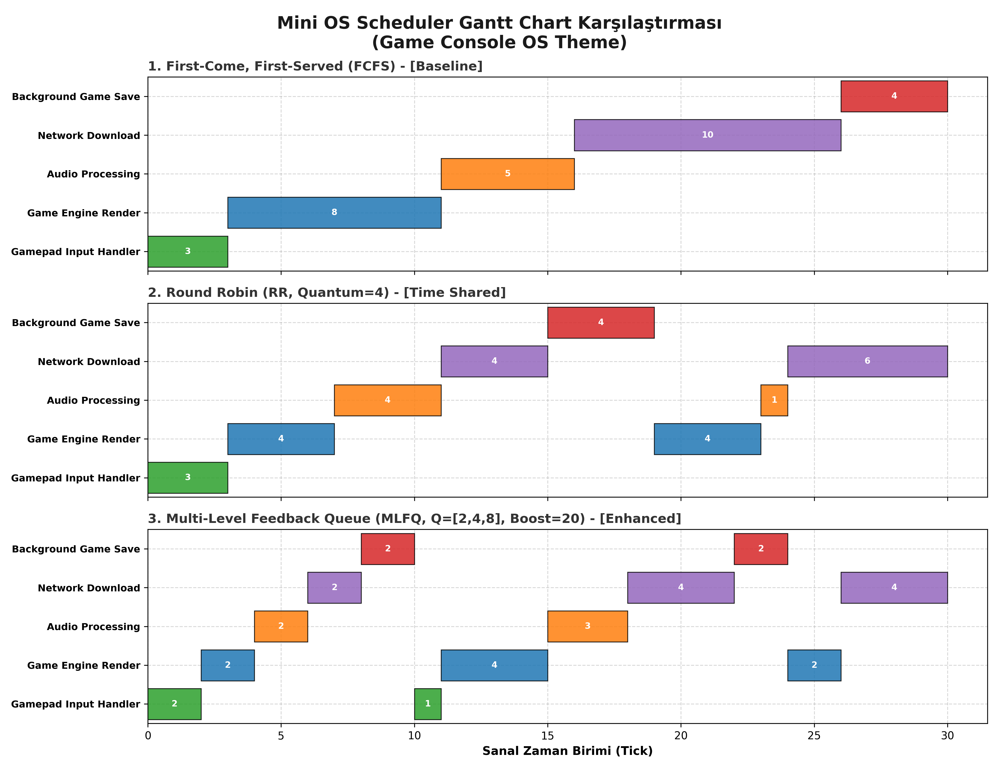
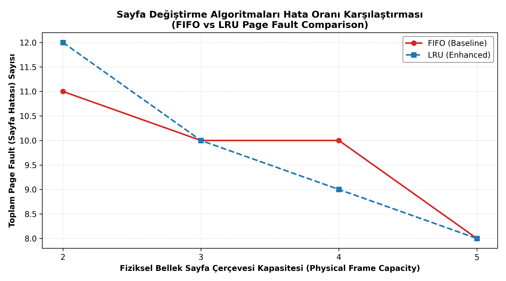
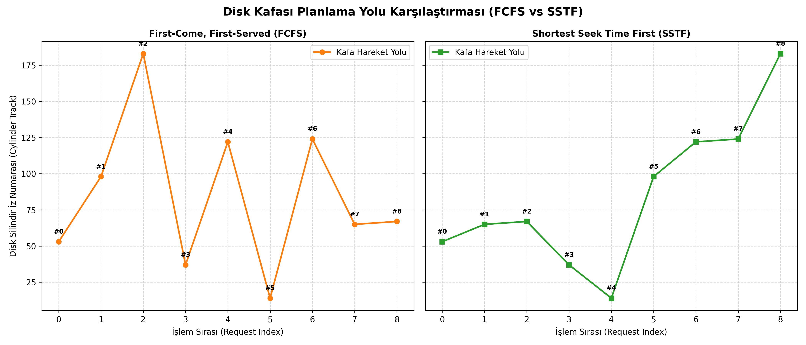
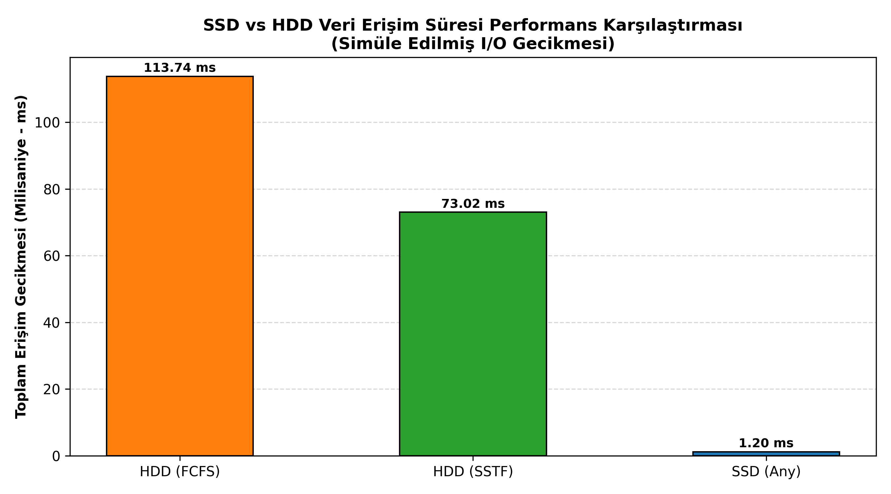

# Mini Operating System Simulator

A terminal-based educational operating system simulator developed with Python.

This project demonstrates the main concepts covered in the CSE 302 Operating Systems course through interactive simulations, algorithm comparisons, terminal output, and automatically generated charts.

The simulator uses a game-console theme for process names and example scenarios. However, the implemented algorithms and operating-system concepts are general-purpose educational models.

Acibadem University
Department of Computer Engineering
CSE 302 Operating Systems

Kaan Mert Ozturk

Repository:

```text
https://github.com/Kaan-Mert/os
```

---

## Project Overview

The Mini Operating System Simulator is a user-space educational application. It is not a bootable operating system and does not interact directly with physical hardware.

Instead, it models the internal behavior of an operating system in a simplified and observable way. The project focuses on process management, CPU scheduling, memory management, concurrency, synchronization, storage systems, file systems, and crash recovery.

The simulator contains sixteen modules that can be accessed through a central terminal-based menu.

The project includes:

* Process creation and Process Control Block simulation
* FCFS, Round Robin, and MLFQ scheduling
* Waiting time and turnaround time calculations
* CPU scheduling Gantt charts
* Virtual-to-physical address translation
* Segmentation and paging
* Translation Lookaside Buffer simulation
* FIFO and LRU page replacement
* Race condition demonstration
* Mutex locks and priority inheritance
* Producer-consumer synchronization
* Thread-safe queue implementation
* FCFS and SSTF disk scheduling
* RAID 0 and RAID 1 simulation
* Hierarchical file-system operations
* Journal-based crash recovery
* SSD and HDD performance comparison

---

## Implemented Modules

### Module 1 - Process Management

The process-management module demonstrates:

* Process creation
* Process termination
* Process state transitions
* Process Control Block representation
* Process listing
* Process-related scheduling information

The Process class stores information such as:

* Process ID
* Process name
* Arrival time
* Burst time
* Remaining execution time
* Priority
* Current state
* Memory requirement
* Waiting time
* Turnaround time
* Page table
* Segment table
* Execution intervals

Supported process states include:

```text
NEW
READY
RUNNING
BLOCKED
COMPLETED
```

### Module 2 - CPU Scheduling

The simulator implements three CPU-scheduling algorithms:

#### First Come First Served

FCFS executes ready processes according to their arrival order.

It is simple and non-preemptive. A long process can delay all processes waiting behind it.

#### Round Robin

Round Robin gives each process a limited amount of CPU time called a time quantum.

The predefined simulation uses:

```text
Time quantum = 4 ticks
```

If a process does not complete within its quantum, it is returned to the ready queue.

#### Multi-Level Feedback Queue

The MLFQ implementation contains three queues with different time quantums:

```text
Queue 0 quantum = 2 ticks
Queue 1 quantum = 4 ticks
Queue 2 quantum = 8 ticks
```

Processes begin in the highest-priority queue. A process that uses its complete quantum without finishing is moved to a lower queue.

A periodic priority boost prevents processes from remaining indefinitely in low-priority queues.

The simulator calculates:

```text
Turnaround Time = Completion Time - Arrival Time

Waiting Time = Turnaround Time - Burst Time
```

The scheduling module also records execution intervals and generates Gantt charts.

### Module 3 - Address Translation

This module demonstrates the conversion of virtual addresses into physical addresses.

For paging-based translation:

```text
Page Number = Virtual Address // Page Size

Offset = Virtual Address % Page Size

Physical Address = Frame Number * Page Size + Offset
```

The default page size is 4096 bytes.

If the requested virtual page is not present in the page table, the simulator reports a page fault.

### Module 4 - Segmentation

The segmentation module divides a process address space into logical regions.

The predefined segments include:

```text
Code
Stack
Heap
Assets
```

Each segment contains:

* A base address
* A limit
* Access-permission information

The physical address is calculated as:

```text
Physical Address = Segment Base + Offset
```

The offset must be smaller than the segment limit. Otherwise, the simulator produces a segmentation-fault result.

### Module 5 - Paging

The paging module demonstrates:

* Virtual pages
* Physical frames
* Page tables
* Page lookup
* Frame allocation
* Page faults

A process page table maps virtual page numbers to physical frame numbers.

### Module 6 - Translation Lookaside Buffer

The Translation Lookaside Buffer is a small cache that stores recently used page-to-frame mappings.

The simulator demonstrates:

* TLB hit
* TLB miss
* Page-table lookup
* TLB insertion
* TLB eviction
* Hit-ratio calculation

The hit ratio is calculated as:

```text
Hit Ratio = TLB Hits / Total Address Accesses
```

The predefined TLB has a capacity of four entries.

### Module 7 - Page Replacement

The simulator implements two page-replacement algorithms:

#### FIFO

FIFO removes the page that entered memory first.

#### LRU

LRU removes the page that has not been used for the longest time.

The simulator processes a reference string, records the frame contents after each access, and calculates:

* Page hits
* Page faults
* Fault rate

The fault rate is calculated as:

```text
Page Fault Rate = Page Faults / Total References
```

### Module 8 - Concurrency

The concurrency module uses multiple threads to modify a shared counter.

Without synchronization, multiple threads can read the same value and overwrite one another's updates. This creates a race condition.

The expected result is:

```text
Expected Counter = Number of Threads * Iterations per Thread
```

The predefined experiment uses:

```text
4 threads
1000 increments per thread
Expected result = 4000
```

The unsafe result can be smaller than 4000 because of lost updates.

### Module 9 - Locks

The lock module demonstrates mutual exclusion.

A mutex ensures that only one thread can execute a critical section at a time.

The project also includes a priority-inversion scenario.

In this scenario:

* A low-priority process owns a shared resource.
* A high-priority process requires the same resource.
* A medium-priority process competes for CPU time.

With priority inheritance enabled, the low-priority resource owner temporarily receives a higher priority so that it can release the resource sooner.

### Module 10 - Semaphores and Producer-Consumer

The producer-consumer module uses a bounded shared buffer.

Producers add items to the buffer, while consumers remove items.

The synchronization objects include:

```text
empty_slots
full_slots
mutex
```

The empty semaphore counts available buffer positions.

The full semaphore counts available items.

The mutex protects the buffer while it is being modified.

### Module 11 - Thread-Safe Queue

The project includes a concurrent FIFO queue.

The implementation uses:

* A mutex
* A not-empty condition variable
* A not-full condition variable

When the queue is empty, consumers wait.

When the queue is full, producers wait.

Waiting threads are notified when the queue state changes.

### Module 12 - Disk Scheduling

The disk-scheduling module implements:

#### FCFS Disk Scheduling

Requests are processed in arrival order.

#### SSTF Disk Scheduling

The request closest to the current disk-head position is processed first.

Head movement is calculated as:

```text
Head Movement = Absolute Value of Next Position - Current Position
```

The simulator displays the service order and total head movement.

### Module 13 - RAID

The project simulates RAID 0 and RAID 1.

#### RAID 0

RAID 0 distributes blocks across multiple disks.

Advantages:

* High storage efficiency
* Potentially improved performance

Disadvantage:

* No fault tolerance

If one disk fails, the complete data cannot be reconstructed.

#### RAID 1

RAID 1 stores a complete copy of the data on each disk.

Advantages:

* Fault tolerance
* Data remains available after one disk failure

Disadvantage:

* Reduced usable storage capacity

The simulator also demonstrates rebuilding a failed RAID 1 disk from a surviving disk.

RAID 0 and RAID 1 are tested with separate RAID-system instances so that their block layouts do not interfere with one another.

### Module 14 - File System

The project implements a hierarchical in-memory file system.

Supported operations include:

* Directory creation
* Nested directory creation
* File creation
* File overwrite
* File deletion
* File lookup
* Directory listing
* Complete tree display

The root directory is represented by:

```text
/
```

The file system exists only during program execution and is not stored permanently on the host system.

### Module 15 - Crash Consistency

The crash-consistency module uses a simple journal.

Before a file operation is completed, the simulator records a journal entry.

Journal states include:

```text
START
COMMIT
```

A START entry means that an operation began.

A COMMIT entry means that the operation completed successfully.

During recovery, the simulator identifies operations that contain START entries without matching COMMIT entries.

Incomplete writes are rolled back so that the file system returns to a consistent state.

### Module 16 - SSD and HDD Analysis

The final module compares mechanical hard disk drives with solid-state drives.

The HDD timing model includes:

* Seek time
* Rotational delay
* Transfer time

The SSD timing model includes:

* Access latency
* Transfer time

The values are educational simulation parameters and are not measurements from a specific commercial device.

---

## Project Structure

```text
os/
|
|-- main.py
|-- README.md
|-- .gitignore
|
|-- core/
|   |-- process.py
|   |-- scheduler.py
|   `-- scenarios.py
|
|-- memory/
|   |-- translation.py
|   |-- segmentation.py
|   |-- paging.py
|   |-- tlb.py
|   `-- replacement.py
|
|-- concurrency/
|   |-- multithreading.py
|   |-- locks.py
|   |-- semaphores.py
|   `-- structures.py
|
|-- storage/
|   |-- disk_scheduler.py
|   |-- raid.py
|   |-- filesystem.py
|   `-- journaling.py
|
|-- analysis/
|   |-- performance.py
|   `-- ssd_hdd.py
|
|-- gantt_chart.png
|-- page_faults.png
|-- disk_scheduling.png
`-- ssd_hdd.png
```

---

## Requirements

The project requires:

```text
Python 3
Rich
Matplotlib
```

The Python standard threading module is used for concurrency experiments.

---

## Installation

Clone the repository:

```bash
git clone https://github.com/Kaan-Mert/os.git
cd os
```

Create a virtual environment.

Windows PowerShell:

```powershell
python -m venv .venv
.venv\Scripts\Activate.ps1
```

macOS or Linux:

```bash
python3 -m venv .venv
source .venv/bin/activate
```

Install the required packages:

```bash
python -m pip install --upgrade pip
pip install rich matplotlib
```

---

## Running the Simulator

Run the project from the repository root:

```bash
python main.py
```

On systems where Python 3 is started with `python3`:

```bash
python3 main.py
```

The terminal menu provides access to the project modules.

```text
[1]  Process Management and CPU Scheduling
[2]  Address Translation
[3]  Segmentation
[4]  Paging and TLB
[5]  FIFO and LRU Page Replacement
[6]  Race Conditions, Mutexes, and Priority Inheritance
[7]  Semaphores and Thread-Safe Data Structures
[8]  FCFS and SSTF Disk Scheduling
[9]  RAID 0 and RAID 1
[10] File System and Crash Consistency
[11] SSD vs HDD Analysis
[0]  Exit
```

All charts can also be generated directly:

```bash
python -c "from main import generate_all_plots; generate_all_plots()"
```

---

## Predefined CPU Workload

The scheduling algorithms are tested with the same process set.

| PID | Process               | Arrival | Burst | Priority | Memory |
| --- | --------------------- | ------- | ----- | -------- | ------ |
| P1  | Gamepad Input Handler | 0       | 3     | 1        | 16 MB  |
| P2  | Game Engine Render    | 1       | 8     | 1        | 128 MB |
| P3  | Audio Processing      | 2       | 5     | 2        | 64 MB  |
| P4  | Network Download      | 3       | 10    | 3        | 32 MB  |
| P5  | Background Game Save  | 4       | 4     | 3        | 64 MB  |

Each scheduler receives a fresh copy of the workload.

---

## Representative Results

### CPU Scheduling Results

| Algorithm   | Average Waiting Time | Average Turnaround Time | Switch Events |
| ----------- | -------------------- | ----------------------- | ------------- |
| FCFS        | 9.20 ticks           | 15.20 ticks             | 5             |
| Round Robin | 11.80 ticks          | 17.80 ticks             | 8             |
| MLFQ        | 13.80 ticks          | 19.80 ticks             | 12            |

FCFS produces the lowest waiting and turnaround averages for this specific workload.

This does not mean that FCFS is always the best scheduling algorithm. Round Robin and MLFQ provide preemption and more responsive CPU sharing at the cost of additional execution intervals and switch events.

### TLB Results

For the predefined address sequence:

```text
Total accesses: 6
TLB hits: 2
TLB misses: 4
Hit ratio: 33.3 percent
```

### Page-Replacement Results

| Frame Capacity | FIFO Faults | LRU Faults |
| -------------- | ----------- | ---------- |
| 2              | 11          | 12         |
| 3              | 10          | 10         |
| 4              | 10          | 9          |
| 5              | 8           | 8          |

The results show that algorithm performance depends on both the reference string and the number of available frames.

### Disk-Scheduling Results

| Algorithm | Total Head Movement |
| --------- | ------------------- |
| FCFS      | 640 cylinders       |
| SSTF      | 236 cylinders       |

For the predefined request sequence, SSTF reduces head movement by 404 cylinders.

This corresponds to an improvement of approximately 63.1 percent relative to FCFS.

### Concurrency Results

The predefined race-condition experiment uses:

```text
4 threads
1000 increments per thread
Expected result: 4000
```

Without synchronization, the actual value is usually smaller than 4000.

A representative unsafe execution produced approximately:

```text
1006
```

With a mutex, the final value is:

```text
4000
```

The exact unsafe result can change between executions because thread scheduling is controlled by Python and the host operating system.

### SSD and HDD Results

| Configuration | Simulated Access Time |
| ------------- | --------------------- |
| HDD with FCFS | 113.74 ms             |
| HDD with SSTF | 60.70 ms              |
| SSD           | 1.20 ms               |

These results are generated by the simulator and should not be interpreted as real device benchmarks.

---

## Generated Charts

The simulator generates the following image files:

```text
gantt_chart.png
page_faults.png
disk_scheduling.png
ssd_hdd.png
```

### CPU Scheduling Gantt Chart

```markdown

```

### FIFO and LRU Page-Fault Comparison

```markdown

```

### FCFS and SSTF Disk-Scheduling Comparison

```markdown

```

### SSD and HDD Comparison

```markdown

```

---

## Integrated Operating-System Scenarios

The project also contains scenarios that combine multiple operating-system concepts.

### I/O Blocking

A running process requests disk data and enters the BLOCKED state.

Another ready process is then selected for CPU execution.

When the I/O operation finishes, the blocked process returns to the READY state.

### Out-of-Memory Handling

The simulator fills the available memory with multiple processes.

When a new critical process cannot be allocated, a low-priority background process is terminated.

Its memory is released, and the critical process allocation is attempted again.

### Priority Inversion

A low-priority process owns a resource required by a high-priority process.

A medium-priority process can delay the low-priority resource owner.

With priority inheritance, the low-priority process temporarily receives a higher priority and releases the resource earlier.

---

## Educational Scope

This project intentionally simplifies real operating-system behavior.

The simulator:

* Does not execute privileged kernel instructions
* Does not manage physical hardware
* Does not create real kernel processes
* Uses simulated CPU ticks
* Uses modeled memory addresses
* Uses numerical disk-cylinder positions
* Stores the virtual file system in memory
* Uses educational SSD and HDD timing values
* Relies on Python and the host operating system for thread scheduling

These limitations make the system safe, understandable, and suitable for course demonstrations.

---

## Possible Future Improvements

Possible extensions include:

* A graphical user interface
* Animated ready queues and process states
* Animated memory frames
* Animated disk-head movement
* Shortest Job First scheduling
* Priority scheduling
* Lottery scheduling
* Completely Fair Scheduling
* Optimal page replacement
* Clock page replacement
* SCAN disk scheduling
* C-SCAN disk scheduling
* LOOK disk scheduling
* C-LOOK disk scheduling
* Persistent virtual file-system storage
* Persistent journaling across program restarts
* CSV or JSON result export
* Automated unit tests
* Configurable workloads loaded from external files
* A complete system-wide simulation combining all modules

---

## Author

Kaan Mert Ozturk
Student ID: 231401025
Department of Computer Engineering
Acibadem University
CSE 302 Operating Systems
June 2026

GitHub:

```text
https://github.com/Kaan-Mert/os
```

---

## Academic Purpose

This repository was developed as an individual comprehensive project for the CSE 302 Operating Systems course.

Its purpose is to demonstrate understanding of the major operating-system topics through executable, observable, and independently testable simulations.
